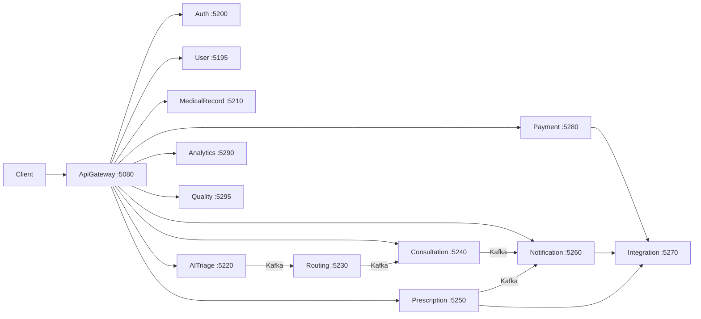

# VitalsBackend

Backend платформы **Vitals** — набор микросервисов на **.NET 8** с Clean Architecture (API / Application / Domain / Infrastructure), event-driven интеграцией через **Kafka** и единой точкой входа **API Gateway**.

Клиенты (web/mobile) работают только с Gateway: `**http://localhost:5080/api/v1/`**.  
Внутренние сервисы общаются по HTTP (`/internal/*`) и Kafka-топикам.

---

## Содержание

- [Структура репозитория](#структура-репозитория)
- [Микросервисы и порты](#микросервисы-и-порты)
- [Требования](#требования)
- [Быстрый старт (локально)](#быстрый-старт-локально)
- [Инфраструктура (Docker)](#инфраструктура-docker)
- [Базы данных PostgreSQL](#базы-данных-postgresql)
- [Конфигурация по умолчанию](#конфигурация-по-умолчанию)
- [Сборка и запуск отдельного сервиса](#сборка-и-запуск-отдельного-сервиса)
- [Нагрузочное тестирование (k6)](#нагрузочное-тестирование-k6)
- [Документация](#документация)

---

## Структура репозитория

```
VitalsBackend/
├── docs/                          # Документация по сервисам, Stubs, ревью ТЗ
├── src/
│   ├── Services/                  # Микросервисы (каждый — свой *.sln)
│   │   ├── ApiGateway/            # BFF, /api/v1/*, rate limit, YARP (ESIA, SignalR)
│   │   ├── AuthService/
│   │   ├── UserService/
│   │   ├── MedicalRecordService/  # Event-sourced медкарта (SoT)
│   │   ├── AITriageService/
│   │   ├── RoutingService/        # Internal-only (без Gateway)
│   │   ├── ConsultationService/   # SignalR hub, SFU adapters
│   │   ├── PrescriptionService/
│   │   ├── NotificationService/
│   │   ├── IntegrationService/    # SMS, email, push, payment, EGISZ, storage
│   │   ├── PaymentService/
│   │   ├── AnalyticsService/
│   │   ├── QualityService/
│   │   ├── docker-compose.yml     # Legacy compose (Auth, User, MR)
│   │   └── docker-compose.infra.yml  # Kafka + Redis
│   └── Shared/                    # Общие библиотеки
│       ├── Vitals.Messaging/      # Kafka producer/consumer
│       ├── Vitals.AspNetCore.Authentication/
│       ├── Vitals.ESignature/
│       └── Vitals.ObjectStorage/  # S3 / stub
└── tests/
    └── load/k6/                   # SLA-нагрузочные сценарии
```

Каждый сервис:


| Слой               | Назначение                                              |
| ------------------ | ------------------------------------------------------- |
| `*.API`            | Controllers, `Program.cs`, Swagger, `appsettings*.json` |
| `*.Application`    | Use cases, DTO, интерфейсы, валидация                   |
| `*.Domain`         | Сущности, enums                                         |
| `*.Infrastructure` | EF Core, HTTP/Kafka clients, repositories               |


---

## Микросервисы и порты


| Сервис               | Путь                                | Порт (dev) | Gateway          | Публичный API                                       |
| -------------------- | ----------------------------------- | ---------- | ---------------- | --------------------------------------------------- |
| **ApiGateway**       | `src/Services/ApiGateway`           | **5080**   | —                | `/api/v1/`*                                         |
| UserService          | `src/Services/UserService`          | 5195       | Да               | `/api/v1/users`, `/api/v1/doctors`, `/api/v1/admin` |
| AuthService          | `src/Services/AuthService`          | 5200       | Да (+ YARP ESIA) | `/api/v1/auth`                                      |
| MedicalRecordService | `src/Services/MedicalRecordService` | 5210       | Да               | `/api/v1/medical-records`                           |
| AITriageService      | `src/Services/AITriageService`      | 5220       | Да               | `/api/v1/triage`                                    |
| RoutingService       | `src/Services/RoutingService`       | 5230       | internal         | `/internal/routing/*`                               |
| ConsultationService  | `src/Services/ConsultationService`  | 5240       | Да (+ YARP hub)  | `/api/v1/consultations`                             |
| PrescriptionService  | `src/Services/PrescriptionService`  | 5250       | Да               | `/api/v1/prescriptions`                             |
| NotificationService  | `src/Services/NotificationService`  | 5260       | Да               | `/api/v1/notifications`                             |
| IntegrationService   | `src/Services/IntegrationService`   | 5270       | internal         | `/internal/integration/*`                           |
| PaymentService       | `src/Services/PaymentService`       | 5280       | Да               | `/api/v1/payments`                                  |
| AnalyticsService     | `src/Services/AnalyticsService`     | 5290       | Да               | `/api/v1/analytics`                                 |
| QualityService       | `src/Services/QualityService`       | 5295       | Да               | `/api/v1/quality`                                   |


**Swagger** (Development): `http://localhost:{port}/swagger` у каждого API-проекта.

**SignalR** (чат консультации): клиент подключается через Gateway  
`ws://localhost:5080/api/v1/consultations/hub/...` → YARP → ConsultationService.

---

## Требования

- [.NET 8 SDK](https://dotnet.microsoft.com/download/dotnet/8.0)
- [Docker Desktop](https://www.docker.com/products/docker-desktop/) (PostgreSQL, Kafka, Redis)
- (опционально) [k6](https://k6.io/) — нагрузочные тесты SLA

---

## Быстрый старт

Из **корня репозитория**:

```powershell
docker compose up --build -d
```

Поднимается полный стек: PostgreSQL (11 БД), Redis, Kafka, все 13 микросервисов и Gateway.


| URL                                                            | Назначение                         |
| -------------------------------------------------------------- | ---------------------------------- |
| [http://localhost:5080](http://localhost:5080)                 | API Gateway (`/api/v1/...`)        |
| [http://localhost:5080/swagger](http://localhost:5080/swagger) | Swagger Gateway                    |
| localhost:9092                                                 | Kafka (host, для внешних клиентов) |


Проверка:

```powershell
curl http://localhost:5080/swagger/index.html
```

Остановка и очистка:

```powershell
docker compose down          # контейнеры
docker compose down -v       # + volumes (PostgreSQL data)
```

Первый запуск занимает несколько минут (сборка образов). Повторный — быстрее.

---

## Быстрый старт (локально без Docker)

### 1. Инфраструктура (без полного Docker-стека)

```powershell
docker compose up -d postgres redis zookeeper kafka
```

Или только Kafka/Redis из корневого compose (см. выше).

### 2. PostgreSQL (отдельные инстансы для локальной разработки)

У каждого сервиса — **своя БД** (отдельный инстанс Postgres на dev-порту).  
Миграции EF Core применяются **автоматически** при старте API (`Database.Migrate()`).

Минимальный набор для demo через Gateway:

```powershell
# Пример: UserService DB на порту 5432
docker run -d --name vitals-pg-user `
  -e POSTGRES_DB=UserServiceDb `
  -e POSTGRES_USER=postgres `
  -e POSTGRES_PASSWORD=postgres123 `
  -p 5432:5432 postgres:15
```

> **UserService:** в `appsettings.json` строка подключения задаётся через переменную окружения:
>
> ```powershell
> $env:DB_CONNECTION_STRING = "Host=localhost;Port=5432;Database=UserServiceDb;Username=postgres;Password=postgres123"
> ```

Полная таблица портов БД — [ниже](#базы-данных-postgresql).  
Per-service `docker-compose.yml` есть в папках Auth, User, MedicalRecord и др.

### 3. Запуск сервисов

**Порядок имеет значение:** сначала **AuthService** (источник JWKS для остальных), затем User и Medical Record, далее — остальные.

```powershell
# Терминал 1 — Auth (обязательно первым)
cd src/Services/AuthService
dotnet run --project AuthService.API

# Терминал 2 — User
cd src/Services/UserService
$env:DB_CONNECTION_STRING = "Host=localhost;Port=5432;Database=UserServiceDb;Username=postgres;Password=postgres123"
dotnet run --project UserService.API

# Терминал 3 — Gateway
cd src/Services/ApiGateway
dotnet run --project ApiGateway.API
```

Остальные сервисы — аналогично (`dotnet run --project *.API` в своей папке).  
Без запущенного backend-сервиса Gateway вернёт 502/503 на соответствующих маршрутах.

### 4. Проверка

- Gateway Swagger: [http://localhost:5080/swagger](http://localhost:5080/swagger)  
- Регистрация: `POST http://localhost:5080/api/v1/auth/register`  
- Health Integration: `GET http://localhost:5270/internal/integration/health`

---

## Инфраструктура (Docker)


| Файл                                                                             | Назначение                                           |
| -------------------------------------------------------------------------------- | ---------------------------------------------------- |
| `[docker-compose.yml](docker-compose.yml)`                                       | **Основной** — весь бэкенд одной командой            |
| `[src/Services/docker-compose.yml](src/Services/docker-compose.yml)`             | Include корневого compose (совместимость)            |
| `[src/Services/docker-compose.infra.yml](src/Services/docker-compose.infra.yml)` | Include корневого compose (совместимость)            |
| `src/Services/*/docker-compose.yml`                                              | Устаревшие per-service compose; используйте корневой |


Build context для всех Dockerfile: каталог `src/` (Shared + Services).

### Включение Kafka

По умолчанию во всех сервисах `"Kafka": { "Enabled": false }`.  
Для event-driven цепочки (triage → routing → consultation → notification):

1. Запустить `docker-compose.infra.yml`
2. В `appsettings.Development.json` нужных сервисов установить `"Enabled": true`
3. Перезапустить сервисы

---

## Базы данных PostgreSQL

Строки подключения из `appsettings.json` (dev):


| Сервис               | БД              | Порт Postgres                           |
| -------------------- | --------------- | --------------------------------------- |
| UserService          | UserServiceDb   | **5432** (через `DB_CONNECTION_STRING`) |
| AuthService          | AuthServiceDb   | 5433                                    |
| MedicalRecordService | MedicalRecordDb | 5434                                    |
| AITriageService      | AITriageDb      | 5435                                    |
| RoutingService       | RoutingDb       | 5436                                    |
| ConsultationService  | ConsultationDb  | 5437                                    |
| PrescriptionService  | PrescriptionDb  | 5438                                    |
| NotificationService  | NotificationDb  | 5439                                    |
| PaymentService       | PaymentDb       | 5440                                    |
| AnalyticsService     | AnalyticsDb     | 5441                                    |
| QualityService       | QualityDb       | 5442                                    |


Учётные данные по умолчанию: `postgres` / `postgres123`.

---

## Конфигурация по умолчанию


| Параметр               | Значение dev                          | Где                                              |
| ---------------------- | ------------------------------------- | ------------------------------------------------ |
| JWT issuer             | `vitals-auth`                         | AuthService                                      |
| JWKS                   | `http://localhost:5200/internal/jwks` | все сервисы                                      |
| Service-to-service key | `vitals-internal-dev-key`             | `ServiceAuth:ApiKey`                             |
| Kafka                  | **выключен**                          | `Kafka:Enabled: false`                           |
| ML (NER/LLM)           | stub                                  | `MlServices:UseStubModels: true`                 |
| SFU (WebRTC)           | P2P на DEV (`mode: p2p`); LiveKit при выкл. stub | `Sfu:UseStub: true`                              |
| E-signature (КЭП)      | stub                                  | `ESignature:UseStub: true`                       |
| Object storage         | stub                                  | `ObjectStorage:UseStub: true`                    |
| Integration providers  | log-stub                              | IntegrationService                               |
| Rate limit Redis       | in-memory fallback                    | Gateway `RateLimiting:UseInMemoryFallback: true` |


Dev JWT bypass (`AllowInsecureDevelopmentBypass: true`) — **только** в `appsettings.Development.json`, не в production.

Полный реестр заглушек: [docs/Stubs.md](docs/Stubs.md).

---

## Сборка и запуск отдельного сервиса

```powershell
cd src/Services/PrescriptionService
dotnet build PrescriptionService.sln
dotnet run --project PrescriptionService.API
```

Solution-файлы:


| Сервис               | Solution                                                       |
| -------------------- | -------------------------------------------------------------- |
| ApiGateway           | `src/Services/ApiGateway/ApiGateway.sln`                       |
| AuthService          | `src/Services/AuthService/AuthService.sln`                     |
| UserService          | `src/Services/UserService/UserService.sln`                     |
| MedicalRecordService | `src/Services/MedicalRecordService/MedicalRecordService.sln`   |
| AITriageService      | `src/Services/AITriageService/AITriageService.sln`             |
| RoutingService       | `src/Services/RoutingService/RoutingService.sln`               |
| ConsultationService  | `src/Services/ConsultationService/ConsultationService.sln`     |
| PrescriptionService  | `src/Services/PrescriptionService/PrescriptionService.sln`     |
| NotificationService  | `src/Services/NotificationService/NotificationService.sln`     |
| IntegrationService   | `src/Services/IntegrationService/IntegrationService.sln`       |
| PaymentService       | `src/Services/PaymentService/PaymentService.sln`               |
| AnalyticsService     | `src/Services/AnalyticsService/AnalyticsService.API/` (csproj) |
| QualityService       | `src/Services/QualityService/QualityService.API/` (csproj)     |


### Shared-библиотеки


| Пакет                              | Назначение                                              |
| ---------------------------------- | ------------------------------------------------------- |
| `Vitals.Messaging`                 | Confluent Kafka producer + `KafkaConsumerHostedService` |
| `Vitals.AspNetCore.Authentication` | JWT + internal service auth (`X-Service-Key`)           |
| `Vitals.ESignature`                | HTTP/stub провайдер КЭП                                 |
| `Vitals.ObjectStorage`             | S3-compatible / stub upload                             |


### EF Core миграции (вручную)

```powershell
dotnet ef migrations add <Name> `
  --project src/Services/<Service>/<Service>.Infrastructure `
  --startup-project src/Services/<Service>/<Service>.API

dotnet ef database update `
  --project src/Services/<Service>/<Service>.Infrastructure `
  --startup-project src/Services/<Service>/<Service>.API
```

При обычном `dotnet run` миграции применяются автоматически.

---

## Нагрузочное тестирование (k6)

Сценарии SLA из ТЗ: [tests/load/k6/README.md](tests/load/k6/README.md)

```powershell
k6 run tests/load/k6/routing-latency.js          # Routing p95 ≤ 500ms
k6 run tests/load/k6/consultation-chat-latency.js # Chat p95 ≤ 100ms
k6 run tests/load/k6/notification-throughput.js   # ≥ 1000 events/s
```

Перед прогоном должны быть запущены целевые сервисы. Переменные окружения — в заголовках скриптов.

---

## Документация


| Документ                                                     | Описание                             |
| ------------------------------------------------------------ | ------------------------------------ |
| [docs/ApiGateway.md](docs/ApiGateway.md)                     | Маршруты, middleware, rate limit     |
| [docs/AuthService.md](docs/AuthService.md)                   | JWT, refresh, ESIA                   |
| [docs/UserService.md](docs/UserService.md)                   | Профили, роли, расписание врачей     |
| [docs/MedicalRecordService.md](docs/MedicalRecordService.md) | Event store, проекции, access grants |
| [docs/AITriageService.md](docs/AITriageService.md)           | NER, LLM triage, Kafka               |
| [docs/RoutingService.md](docs/RoutingService.md)             | Маршрутизация, scheduler             |
| [docs/ConsultationService.md](docs/ConsultationService.md)   | SignalR, WebRTC, протоколы           |
| [docs/Frontend-TZ-Video.md](docs/Frontend-TZ-Video.md)       | ТЗ фронта: видео + чат + клиника     |
| [docs/PrescriptionService.md](docs/PrescriptionService.md)   | Рецепты, валидация, КЭП              |
| [docs/NotificationService.md](docs/NotificationService.md)   | Каналы, шаблоны, DLQ                 |
| [docs/Stubs.md](docs/Stubs.md)                               | Реестр заглушек и dev-only поведения |
| [docs/TZ-Compliance-Review.md](docs/TZ-Compliance-Review.md) | Соответствие ТЗ, фазы 1–3            |


---

## Архитектура (кратко)




**Production:** включить Kafka, Redis (Gateway rate limit), реальные провайдеры (ML, SFU, КЭП, payment, EGISZ, S3), отключить dev bypass — см. [docs/Stubs.md](docs/Stubs.md) и [docs/TZ-Compliance-Review.md](docs/TZ-Compliance-Review.md).