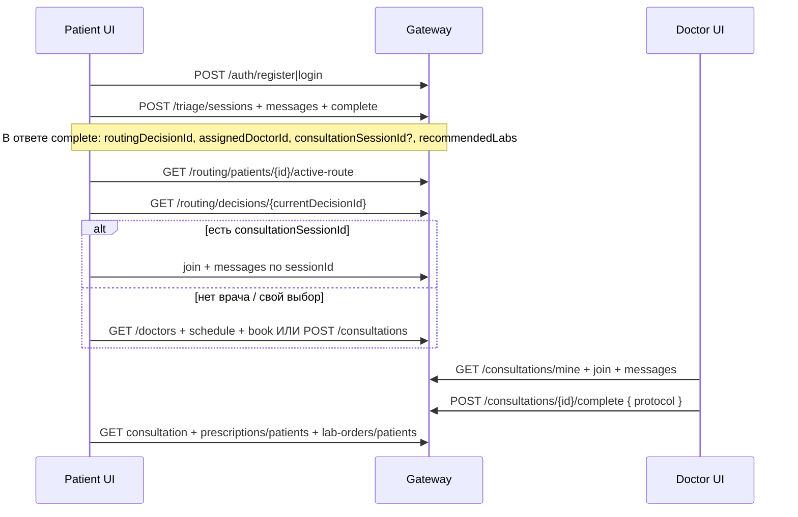

# ТЗ фронтенда — MVP Vitals (полный юзерфлоу)

Цель: закрыть путь **регистрация → триаж → маршрут/врач → консультация → рецепт/анализы** на готовых API Gateway (`/api/v1/*`).

Базовый URL: `GATEWAY` (локально обычно `http://localhost:5080`).  
JWT: `Authorization: Bearer …`. Роль в токене: `Patient` / `Doctor` (`switch-profile` при необходимости).

---

## 0. Критерий готовности MVP

Пациент может:

1. Зарегистрироваться / войти.
2. Пройти триаж (mock LLM ок) и увидеть маршрут / назначенного врача / анализы.
3. Открыть чат или записаться на слот.
4. Получить протокол после complete врача.
5. Увидеть **реальный рецепт** (список + инструкции/QR) и **направления на анализы**.

Врач может: календарь, чат, complete с диагнозом / `labOrders` / `prescriptions`, профиль «О враче».

---

## 1. Happy path (обязательный сценарий)



### Шаги и API

| # | Действие | Метод | Путь | Кто | Что важно |
|---|----------|-------|------|-----|-----------|
| 1 | Регистрация | POST | `/api/v1/auth/register` | anon | `patientProfile` и/или `doctorProfile` (`specialization`: лучше `therapist` / `терапевт`) |
| 2 | Логин | POST | `/api/v1/auth/login` | anon | Сохранить access/refresh; при двух профилях — `POST /auth/switch-profile` |
| 3 | Старт триажа | POST | `/api/v1/triage/sessions` | Patient | body: `{ patientId }` |
| 4 | Сообщения | POST | `/api/v1/triage/sessions/{id}/messages` | Patient | `{ message }` → смотреть `readyToComplete` |
| 5 | Завершить триаж | POST | `/api/v1/triage/sessions/{id}/complete` | Patient | CTA когда `readyToComplete: true` (см. §2) |
| 6 | Мой путь | GET | `/api/v1/routing/patients/{patientId}/active-route` | JWT | `currentDecisionId`, steps |
| 7 | Решение | GET | `/api/v1/routing/decisions/{decisionId}` | JWT | `recommendedLabs`, `assignedDoctorId`, `outcomeType` |
| 8a | Авто-чат | — | из `consultationSessionId` после complete | Patient | `POST .../join`, messages, SignalR |
| 8b | Выбор врача | GET | `/api/v1/doctors?specialization=` | anon/JWT | карточки |
| 8c | Слоты | GET | `/api/v1/doctors/{id}/schedule` | anon/JWT | `isAvailable: true` |
| 8d | Запись | POST | `/api/v1/consultations/book` | **Patient** | `{ doctorId, slotId, consultationType, urgencyLevel }` — **не** сырой `POST /consultations` для слота |
| 8e | Свободный чат | POST | `/api/v1/consultations` | JWT | open/reuse; для «сейчас» |
| 9 | Список | GET | `/api/v1/consultations/mine` | JWT | `isScheduled`, `scheduledAt` |
| 10 | Чат | GET/POST | `.../messages`, hub | оба | `sentAt`/`readAt`, `markAsRead` |
| 11 | Complete | POST | `/api/v1/consultations/{id}/complete` | **Doctor** | протокол (диагноз, `labOrders[]`, `prescriptions[]`) |
| 12 | Протокол | GET | `/api/v1/consultations/{id}` | оба | `protocol`, `hasProtocol`, статус `Completed` |
| 13 | Рецепты | GET | `/api/v1/prescriptions/patients/{patientId}` | JWT | после complete с `prescriptions[]` — **Signed** |
| 14 | Инструкции/QR | GET | `/api/v1/prescriptions/{id}/instructions` и `/qr` | JWT | для пациента |
| 15 | Анализы | GET | `/api/v1/lab-orders/patients/{patientId}` | JWT | из triage LabsBeforeConsultation и/или complete |

---

## 2. Триаж-чат: когда показывать «Завершить»

В ответе на `POST .../messages` (и `GET .../sessions/{id}`):

```json
{
  "readyToComplete": true,
  "completeSuggestion": "Ключевых деталей достаточно. Можете нажать «Завершить триаж»…",
  "latestAssessment": {
    "llmResult": {
      "readyToComplete": true,
      "completeSuggestion": "...",
      "urgencyLevel": 3,
      "recommendedAction": "..."
    }
  }
}
```

**Фронт:** если `readyToComplete === true` — кнопка «Завершить триаж» → `POST .../complete`.  
Пациент может завершить и раньше (кнопка всегда доступна), но акцент/primary — когда ИИ предлагает.

## 2b. Контракт после `POST .../triage/.../complete`

Бэкенд (локально без Kafka) **синхронно** вызывает Routing. В ответе сессии дополнительно:

```json
{
  "sessionId": "...",
  "status": "Completed",
  "routingDecisionId": "...",
  "routingOutcomeType": "Consultation",
  "assignedDoctorId": "...",
  "assignedDoctorName": "...",
  "recommendedLabs": [],
  "consultationSessionId": "...",
  "recommendation": "...",
  "recommendedSpecialization": "therapist"
}
```

**Фронт обязан:**

1. Если есть `consultationSessionId` — сразу вести в чат этой сессии (или показать CTA «Открыть консультацию»).
2. Иначе если есть `assignedDoctorId` — карточка врача + кнопки «Написать» (`POST /consultations`) / «Записаться» (schedule → book).
3. Если `recommendedLabs.length > 0` — блок «Сдайте анализы» + `GET lab-orders/patients/{id}` и/или decision.
4. Всегда обновить «Мой путь»: `active-route` → `currentDecisionId` → `getDecision`.
5. Fallback текста шага: `Назначены анализы: …` в `steps[].description`.

При Kafka-only (Docker) поля routing в complete могут быть пустыми — тогда сразу poll `active-route` (1–2 с).

---

## 3. Complete консультации (врач)

```json
POST /api/v1/consultations/{sessionId}/complete
{
  "complaints": "...",
  "anamnesis": "...",
  "examinationNotes": "...",
  "preliminaryDiagnosisIcd10": "J06.9",
  "preliminaryDiagnosisText": "ОРВИ",
  "recommendations": "...",
  "nextVisitDate": null,
  "labOrders": ["ОАК", "СРБ"],
  "prescriptions": ["Амоксициллин 500 мг — 3 р/день 7 дней"]
}
```

**Что делает бэкенд сам (фронту не дублировать):**

- Статус → `Completed`, `protocol` в ответе.
- `labOrders[]` → `POST` lab-orders + шаг в active-route + merge в `recommendedLabs`.
- `prescriptions[]` → создание **и подпись** рецепта в PrescriptionService (события в медкарте).
- Диагноз → `DiagnosisConfirmed` в MR.

Повторный `/complete` на Completed — **ок** (обновление протокола). Не показывать как фатал.

**После complete пациент:**

- `GET /consultations/{id}` — протокол.
- `GET /prescriptions/patients/{patientId}` — рецепты; карточка → instructions / qr.
- `GET /lab-orders/patients/{patientId}` — направления.
- `GET /medical-records/patients/{id}/state|history|attachments` — агрегаты/документы.

Опционально врач может создать рецепт отдельно: `POST /prescriptions` → `sign` (если нужен полноценный ATC/форма без строк протокола).

---

## 4. Экраны MVP (что сверстать)

### Пациент

| Экран | Данные |
|-------|--------|
| Логин / регистрация | auth |
| Триаж-чат | triage sessions/messages/complete |
| Результат триажа / «Мой путь» | complete fields + active-route + decision |
| Список врачей | `GET /doctors` |
| Карточка врача | `GET /doctors/{id}`, biography, schedule |
| Запись на слот | schedule → book |
| Мои консультации | `GET /consultations/mine` |
| Чат консультации | join, messages, SignalR hub |
| Документы / рецепты | prescriptions + MR attachments/history |
| Анализы | lab-orders patients |
| Медкарта (кратко) | state |

### Врач

| Экран | Данные |
|-------|--------|
| Профиль «О враче» | `PATCH /doctors/me/profile` |
| Календарь | `GET /doctors/me/calendar?from=&days=` + CRUD slots |
| Список консультаций | `mine` |
| Чат + протокол | complete form: диагноз, анализы (chips/textarea→массив), рецепты (строки) |
| Пациент (сайдбар) | triage sessions, MR state, calendar cell details |

### Общее

- Ошибки: показывать `error` / `errors[]` из Gateway (RU).
- Title/favicon/logo — фронт-only.
- Уведомления: `GET /notifications/history` + фильтр `category` (nice-to-have; badge/read API нет).

---

## 5. Важные правила (чтобы не сломать флоу)

1. **Запись на время** — только `POST /consultations/book` + `slotId`.  
   `POST /consultations` = свободный чат «сейчас», слот не бронирует.
2. Список записей пациента — **`/consultations/mine`**, не только `/active`.
3. После book — сохранить `sessionId` из ответа.
4. Рецепт пациенту — из `GET /prescriptions/patients/...`, не из текста протокола.
5. Анализы — `lab-orders`, не только строки в протоколе.
6. Время слотов — UTC с `Z`.
7. Специализация врача при регистрации: `therapist` или `терапевт` (routing ищет по алиасам).
8. Для демо нужен **хотя бы один активный Doctor** с подходящей специализацией — иначе `assignedDoctorId` пустой, пациент выбирает вручную из каталога.

---

## 6. UI-долги (не блокируют API, но нужны для продукта)

| P | Задача |
|---|--------|
| P0 | Экраны §1 happy path end-to-end |
| P0 | После triage complete — ветвление по `consultationSessionId` / `assignedDoctorId` / labs |
| P0 | Complete-форма врача → массивы `labOrders` / `prescriptions` |
| P0 | Экран рецепта: instructions + QR |
| P1 | «О враче» форма + отображение biography |
| P1 | Чат: свои/чужие, `sentAt`, `readAt`, SignalR `messagesRead` |
| P1 | Календарь врача (`me/calendar`) |
| P1 | Документы из MR `DocumentUploaded` / `PrescriptionIssued` |
| P2 | Уведомления + фильтр category |
| P2 | Favicon, title, logo, Figma |

---

## 7. Smoke curl (локальный MVP)

```bash
# 1) Пациент
curl -s -X POST "$GATEWAY/api/v1/auth/login" -H 'Content-Type: application/json' \
  -d '{"email":"...","password":"..."}'

# 2) Триаж
curl -s -X POST "$GATEWAY/api/v1/triage/sessions" -H "Authorization: Bearer $PATIENT" \
  -H 'Content-Type: application/json' -d "{\"patientId\":\"$PATIENT_ID\"}"
curl -s -X POST "$GATEWAY/api/v1/triage/sessions/$TRIAGE/messages" -H "Authorization: Bearer $PATIENT" \
  -H 'Content-Type: application/json' -d '{"message":"температура 38.2, болит горло 3 дня"}'
curl -s -X POST "$GATEWAY/api/v1/triage/sessions/$TRIAGE/complete" -H "Authorization: Bearer $PATIENT"
# → routingDecisionId, assignedDoctorId, consultationSessionId?

# 3) Маршрут
curl -s "$GATEWAY/api/v1/routing/patients/$PATIENT_ID/active-route" -H "Authorization: Bearer $PATIENT"

# 4) Чат / book (если session уже есть — join)
curl -s -X POST "$GATEWAY/api/v1/consultations/$SESSION/join" -H "Authorization: Bearer $PATIENT"

# 5) Врач complete
curl -s -X POST "$GATEWAY/api/v1/consultations/$SESSION/complete" -H "Authorization: Bearer $DOCTOR" \
  -H 'Content-Type: application/json' -d '{
    "complaints":"боль в горле","anamnesis":"-","examinationNotes":"-",
    "preliminaryDiagnosisIcd10":"J06.9","preliminaryDiagnosisText":"ОРВИ",
    "recommendations":"покой","labOrders":["ОАК"],
    "prescriptions":["Парацетамол 500 мг — при температуре"]
  }'

# 6) Пациент: рецепты и анализы
curl -s "$GATEWAY/api/v1/prescriptions/patients/$PATIENT_ID" -H "Authorization: Bearer $PATIENT"
curl -s "$GATEWAY/api/v1/lab-orders/patients/$PATIENT_ID" -H "Authorization: Bearer $PATIENT"
```

---

## 8. Вне MVP (не ждать от бэка для демо)

- Реальная аптека / ЕГИСЗ / ESIA / оплата.
- Push/SMS (Integration — log-stub); in-app history можно показать.
- Видео SFU (stub).
- Badge непрочитанных уведомлений без `PATCH .../read`.
- Авто-создание lab-orders без назначенного врача (нужен doctorId).

---

## 9. Ссылки на контракты бэка

- Gateway overview: `docs/ApiGateway.md`
- Routing: `docs/RoutingService.md`
- Prescriptions + lab-orders: `docs/PrescriptionService.md`
- Consultations / book / calendar: `docs/ApiGateway.md`, `docs/ConsultationService.md`
