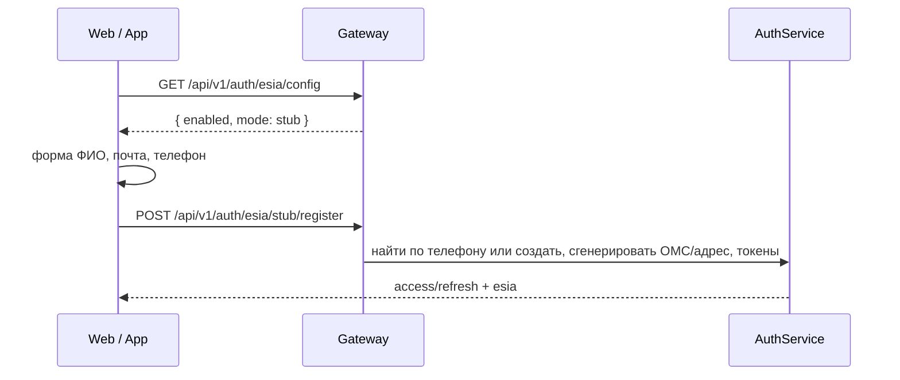
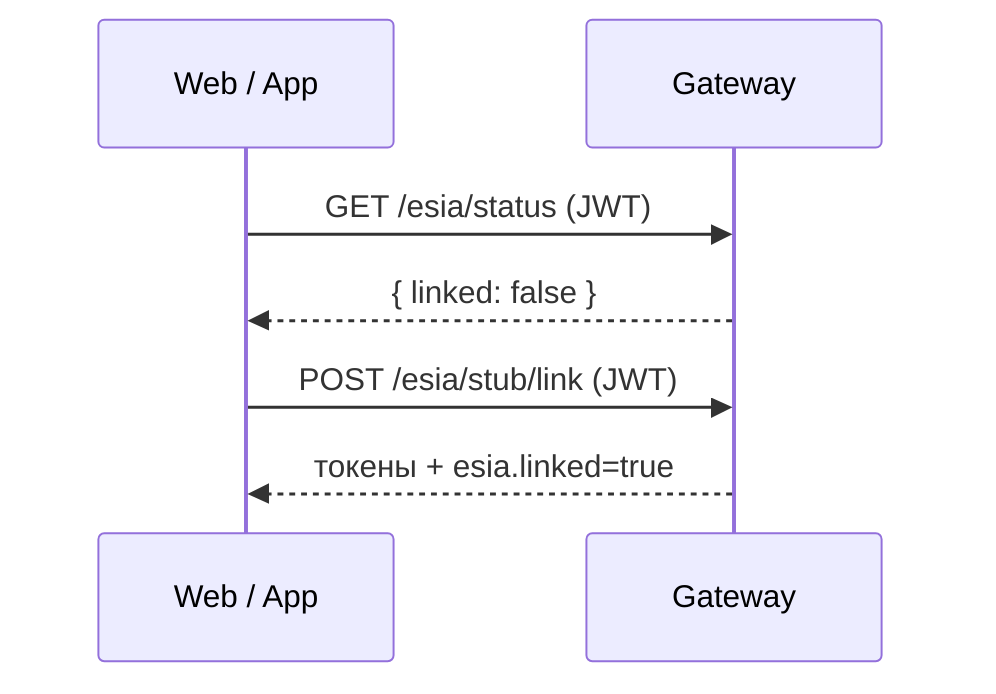

# ТЗ: Госуслуги (DEV-заглушка) — веб и мобилка

Базовый URL: `GATEWAY` (`http://localhost:5080` локально).  
**На DEV живого портала ЕСИА нет.** Кнопка «Госуслуги» открывает форму в приложении. Бэк генерирует ОМС, СНИЛС, адрес, дату рождения, пол и снимок в медкарту.

Production: `enabled: false` — кнопки не показывать.

Ключ аккаунта — **телефон**. Один человек = один аккаунт, независимо от того, зашёл он по телефону или через Госуслуги.

---

## 0. Что должно появиться в UI

1. На экране входа/регистрации кнопка **«Войти через Госуслуги»**, если `enabled: true`.
2. По нажатию — **не редирект на gosuslugi.ru**, а модалка/экран с полями: фамилия, имя, отчество (необяз.), почта, телефон.
3. В профиле / настройках — блок **«Госуслуги»**: статус привязки и кнопка **«Подключить Госуслуги»**, если ещё не привязано. Пароль и ФИО повторно **не спрашивать**.
4. После успеха — ФИО (если спрашивали), ОМС и адрес в профиле; в медкарте событие импорта.

Если `mode !== "stub"` — этот документ не применять (живой OAuth пока выключен).

---

## 1. Конфиг (вызвать при старте)

`GET /api/v1/auth/esia/config` — без JWT.

```json
{
  "enabled": true,
  "mode": "stub",
  "configured": true,
  "portal": "stub",
  "redirectUri": "http://localhost:5080/api/v1/auth/esia/callback",
  "intents": ["register", "link"],
  "collects": ["fullName", "email", "phone"],
  "generates": ["oms", "snils", "birthDate", "gender", "residenceAddress", "registrationAddress", "medicalRecordSnapshot"],
  "skipped": ["clinics", "doctors"]
}
```

| Поле | Как использовать |
|---|---|
| `enabled: false` | Кнопки Госуслуг скрыть |
| `mode: "stub"` | Форма в приложении, не браузер Госуслуг |
| `configured: true` | Можно жать кнопку |

Статус привязки (нужен JWT):

`GET /api/v1/auth/esia/status`

```json
{
  "linked": true,
  "linkedAt": "2026-08-16T12:00:00Z",
  "snilsMasked": "***7890"
}
```

---

## 2. Один человек — один аккаунт

Телефон — общий идентификатор.

| Сценарий | Что делает бэк |
|---|---|
| Сначала регистрация по телефону+пароль, потом «Госуслуги» с **тем же** телефоном | Тот же `userPublicId`. Пароль, ФИО, почта и дата рождения **не меняются**. Дописываются ОМС, адрес, СНИЛС |
| Сначала «Госуслуги», потом вход по телефону | Тот же аккаунт. Пароль для входа: `GosuslugiDev1!` (только если аккаунт создан через Госуслуги, бэк отдаёт его в `esia.devPassword`) |
| «Подключить Госуслуги» у уже вошедшего | Тот же аккаунт. ФИО, телефон, пароль и дата рождения не трогаем. Генерируются ОМС, адрес, СНИЛС, снимок медкарты |
| «Госуслуги» с телефоном, которого ещё нет | Создаётся новый аккаунт, пользователь сразу залогинен |

Не создавать второй профиль / второго пользователя на тот же номер.

Если `esia.existingAccount: true` — тост: «Вошли в существующий аккаунт с этим телефоном».

---

## 3. Сценарий A — регистрация / вход через Госуслуги

Пользователь **не** авторизован (экран логина).



### 3.1. Форма (только это спрашивать)

| Поле | Обязательно | JSON |
|---|---|---|
| Фамилия | да | `lastName` |
| Имя | да | `firstName` |
| Отчество | нет | `middleName` |
| Почта | да | `email` |
| Телефон | да | `phoneNumber` (любой привычный формат, бэк нормализует в `7XXXXXXXXXX`) |

Пароль, дату рождения, пол, адрес, ОМС **не показывать**.

### 3.2. Запрос

`POST /api/v1/auth/esia/stub/register` — без JWT.

```json
{
  "lastName": "Иванов",
  "firstName": "Иван",
  "middleName": "Иванович",
  "email": "ivan@example.com",
  "phoneNumber": "+7 999 123-45-67"
}
```

Ответ 200 — как у `POST /auth/login`, плюс блок `esia`:

```json
{
  "accessToken": "…",
  "refreshToken": "…",
  "expiresIn": 900,
  "userPublicId": "…",
  "esia": {
    "linked": true,
    "fullName": "Иванов Иван Иванович",
    "omsImported": true,
    "addressImported": true,
    "medicalRecordSnapshotWritten": true,
    "existingAccount": false,
    "devPassword": "GosuslugiDev1!",
    "skipped": ["clinics", "doctors"]
  }
}
```

Сохранить токены как после обычного логина.

| `esia` | UI |
|---|---|
| `existingAccount: false` | Новый аккаунт. Если есть `devPassword` — один раз показать: «Пароль для входа по телефону: …» (можно скопировать). Дальше обычный логин: этот телефон + этот пароль |
| `existingAccount: true` | Уже был аккаунт с этим номером. `devPassword` нет — вход по телефону со **старым** паролем |

Затем:

1. `GET /api/v1/users/{userPublicId}` — ФИО, почта, телефон; в `profiles[].data` ОМС, СНИЛС, `residenceAddress`.
2. `GET /api/v1/medical-records/patients/{userPublicId}/history?eventTypes=EsiaImported,DocumentUploaded`.

### 3.3. Ошибки

| Ситуация | Что показать |
|---|---|
| `enabled: false` / 503 | «Вход через Госуслуги на этой среде выключен» |
| 400 «Укажите фамилию и имя» / почту / телефон | Подсветка полей формы |
| Аккаунт заблокирован | Как на обычном логине |

Не вызывать `GET /esia/start` и не открывать `authorizationUrl`.

---

## 4. Сценарий B — подключить Госуслуги к существующему аккаунту

Пользователь уже вошёл по телефону/паролю (есть JWT).



`POST /api/v1/auth/esia/stub/link`  
**Заголовок `Authorization: Bearer …` обязателен.** Тело пустое `{}`. Без JWT → 401.

Форму ФИО/почты/телефона **не показывать**. Бэк берёт телефон текущего аккаунта и генерирует ОМС, адрес, СНИЛС, снимок медкарты. ФИО, пароль и дата рождения не меняются.

Ответ 200 — та же `TokenPairResponse`, что в сценарии A (`existingAccount: true`, без `devPassword`). Сохранить новые токены, обновить профиль и медкарту.

Если `status.linked === true` — кнопку «Подключить» скрыть, показать «Госуслуги подключены».

---

## 5. Веб

1. `GET config`. Если `enabled && mode === "stub"` — показать кнопку.
2. Логин: кнопка → модалка с 5 полями → `POST stub/register` → токены в storage → в приложение.
3. Профиль: `GET status`. Если не привязано — кнопка → сразу `POST stub/link` (можно спиннер «Подключаем Госуслуги…»).
4. Не iframe, не `window.location` на gosuslugi.ru.
5. Не логировать access_token и `devPassword` в аналитику.

---

## 6. Мобилка (iOS / Android / Expo)

Тот же API, без системного браузера и без `vitals://esia`.

1. Кнопка на логине → нативный экран формы (ФИО, почта, телефон) → `POST /api/v1/auth/esia/stub/register`.
2. В настройках → `POST /api/v1/auth/esia/stub/link` с JWT.
3. Сохранить токены, закрыть экран, загрузить профиль.

Deep link и `responseMode` для DEV-заглушки **не нужны**.

---

## 7. Куда смотреть данные после импорта

| Данные | Откуда | Кто заполняет |
|---|---|---|
| ФИО, email, телефон | форма только у **нового** аккаунта; у существующего не меняются | бэк не затирает при входе/привязке |
| Дата рождения, пол | сгенерированы только при **создании** через Госуслуги | у существующего аккаунта не меняются |
| ОМС (`insuranceNumber`), СНИЛС, адрес проживания/регистрации | сгенерированы | бэк; ОМС — 16 цифр |
| Снимок «медкарта с Госуслуг» | `history?eventTypes=EsiaImported` | бэк |
| Полис как документ | `eventTypes=DocumentUploaded` | бэк |

Адрес (пример):

```json
{
  "postCode": "125009",
  "country": "RUS",
  "region": "Москва",
  "city": "Москва",
  "street": "Тверская",
  "house": "1",
  "flat": "10"
}
```

ОМС/СНИЛС на чтении могут быть зашифрованы — маскируйте, если бэк не отдаёт plaintext.

Клиники и врачи **не придут**.

---

## 8. Не делать

- Не открывать `esia-portal1.test.gosuslugi.ru` и не строить OAuth URL.
- Не вызывать `GET /esia/start`, `GET /esia/callback`, `POST /esia/complete` на DEV.
- Не спрашивать пароль, адрес, ОМС, дату рождения на форме Госуслуг.
- Не создавать второго пользователя, если телефон уже есть.
- Не показывать Госуслуги в production (`enabled: false`).
- Не импортировать клиники и врачей.
